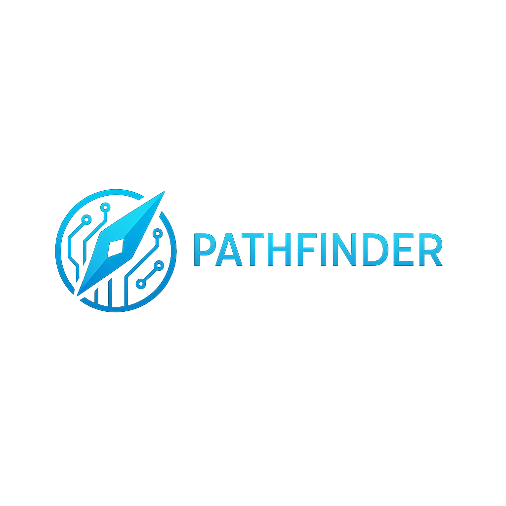

<p align = "center">
  
</p>

<hr>

# 📖 About the application 
<p>Our team's task is to create a website using Flask and Python, the main goal is to predict the most suitable school for a seventh grader.</p>

# 📥 Installation
<p><i>These instructions will help you copy and run our project.</i></p>

## 🕹️ Compile from source
- <p>Prerequisites</p>
```
Code Editor(e.g. Visual Studio)
Git
```

- <p>Installing<p>
<p>1. Clone the repo</p>

```
https://github.com/codingburgas/2425-11-g-pp-student-practices-assignment-team10.git
```
<p>2. Open the project in some IDE.</p>
<p>3. Run the project!</p>

<h1>📄 Documentation</h1>
<h3> ➤ <a href="docs/Documentation.docx">Documentation</a> </h3>
<h3> ➤ <a href="docs/Presentation.pptx">Presentation </a> </h3>

<h1>💻 Used Technologies</h1>
  
<p>
  
  <strong>Python</strong> – Main Language
</p>

<p>
  
  <strong>PyCharm</strong> – IDE for Development
</p>

<p>
  
  <strong>Flask</strong> – Web Framework
</p>

<p>
  
  <strong>Git</strong> – Source Control
</p>

<p>
  
  <strong>MS Word</strong> – Documentation
</p>

<p>
  
  <strong>MS PowerPoint</strong> – Presentations
</p>

<p>
  
  <strong>MS Excel</strong> – Quality Analysis
</p>


#  🏆 The Team
<p><a href="https://github.com/SGSkuliev21">Stoyan Skuliev</a> - Scrum Trainer</p>
<p><a href="https://github.com/GAAtanasov21">Georgi Atanasov</a> - Back-end Developer</p>
<p><a href="https://github.com/MTNenkov21">Martin Nenkov</a> - Back-end Developer</p>
<p><a href="https://github.com/ADAtanasov21">Atanas Atanasov</a> - Designer</p>
<p><a href="https://github.com/KMZheleva21">Kristina Zheleva</a> - Designer</p>
